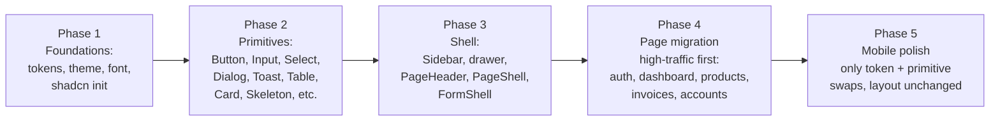

# BMS UI Design System Upgrade

> Source-of-truth plan for migrating the BMS app to a shadcn/ui-based design system.
> Safe to resume from any phase — each phase ships independently and the app stays working between phases.

## Overview

Introduce a shadcn/ui-based design system on top of the existing Vite + React 19 + Tailwind v4 stack, with a green/white theme, Inter font, Sonner toasts, and uniform page/form/loading/error patterns. Roll out in phases: foundations → primitives → shared layout (sidebar, header, page shell) → page-by-page migration. Mobile keeps its current shell with minor polish.

## 1. Stack reality check

- App is **Vite + React 19 + React Router 7 + Tailwind v4** (NOT Next.js, despite the `app/` folder). shadcn must be installed via the **Vite recipe**, not the Next one.
- Tailwind v4 is already wired (`@import "tailwindcss"` in `app/globals.css`); shadcn supports v4 via the new `@theme` directive.
- Existing brand greens already in code: `#02955a` (primary), `#33b38c` (mobile teal). We keep these.
- No Radix / shadcn / class-variance-authority / sonner today.

## 2. Phased rollout



Each phase ships independently and the app stays working between phases (old SCSS + new shadcn coexist; new components are adopted page-by-page).

---

## Phase 1 — Foundations

### 1a. Install
- `clsx`, `tailwind-merge`, `class-variance-authority`, `tailwindcss-animate`
- `@radix-ui/*` (pulled transitively by shadcn add)
- `sonner` (toasts)
- `lucide-react` (replace mixed `react-icons` usage gradually; keep `react-icons` while migrating)
- `@fontsource-variable/inter` (self-hosted Inter, no CDN, PWA-friendly)
- Dev: `tw-animate-css` if needed for shadcn v4 setup

### 1b. shadcn init (Vite + TW v4)
- Create `components.json` at repo root with:
  - `style: "new-york"`, `rsc: false`, `tsx: true`, `tailwind.cssVariables: true`
  - Aliases: `components: "@/app/components/ui"`, `utils: "@/lib/utils"`, `hooks: "@/app/hooks"`
- Create `lib/utils.ts` exporting `cn(...)`.
- Ensure `tsconfig` + `vite.config.ts` resolve the `@/` alias (likely already there).

### 1c. Design tokens — single source of truth
Rewrite `app/globals.css` to define the full token set as CSS variables under `@theme` and `:root` / `.dark` (dark mode optional but scaffolded):

```css
@import "tailwindcss";
@import "tw-animate-css";
@import "@fontsource-variable/inter/index.css";

@theme {
  --font-sans: "Inter Variable", ui-sans-serif, system-ui, sans-serif;
  --radius: 0.625rem;

  /* Brand */
  --color-primary: #02955a;
  --color-primary-foreground: #ffffff;
  --color-primary-50:  #e6f6ee;
  --color-primary-100: #c2e9d5;
  --color-primary-500: #02955a;
  --color-primary-600: #027a4a;
  --color-primary-700: #015a37;

  /* Neutrals */
  --color-background: #ffffff;
  --color-foreground: #0f172a;
  --color-muted: #f5f6f8;
  --color-muted-foreground: #6b7280;
  --color-border: rgba(15, 23, 42, 0.08);
  --color-input: rgba(15, 23, 42, 0.12);
  --color-ring: var(--color-primary);

  /* Semantic */
  --color-destructive: #dc2626;
  --color-success: var(--color-primary);
  --color-warning: #d97706;
  --color-info: #0284c7;

  /* Surfaces */
  --color-card: #ffffff;
  --color-card-foreground: var(--color-foreground);
  --color-popover: #ffffff;
  --color-accent: #ecfdf5;
  --color-accent-foreground: var(--color-primary-700);
}
```
- Keep existing `--mobile-*` tokens in `app/styles/mobile-tokens.scss` but **re-point them to the new vars** (`--mobile-teal-dark: var(--color-primary)`, etc.) so the mobile shell automatically adopts the new palette.

### 1d. Font system
- Inter Variable, weights 400/500/600/700, self-hosted via `@fontsource-variable/inter`.
- Type scale (Tailwind utilities, no magic numbers in SCSS):
  - Display: `text-2xl/3xl font-semibold tracking-tight`
  - H1: `text-xl font-semibold`
  - H2: `text-lg font-semibold`
  - Body: `text-sm` (default in app), `text-base` on marketing/auth
  - Caption: `text-xs text-muted-foreground`
- Remove `font-family: Arial...` body rule.

---

## Phase 2 — shadcn primitives

Run `npx shadcn@latest add` for: `button`, `input`, `label`, `textarea`, `select`, `checkbox`, `radio-group`, `switch`, `dialog`, `alert-dialog`, `dropdown-menu`, `popover`, `command`, `combobox`, `table`, `card`, `badge`, `tabs`, `accordion`, `tooltip`, `separator`, `skeleton`, `sheet`, `scroll-area`, `breadcrumb`, `pagination`, `form`, `sonner`, `avatar`, `progress`, `alert`.

Land them at `app/components/ui/*`. Then add a thin app layer on top so pages never import shadcn directly when there's a shared pattern:

- `app/components/ui-ext/DataTable.tsx` — generic table with skeleton/empty/error states, sticky header, zebra rows off by default, hover row highlight `bg-primary/5`.
- `app/components/ui-ext/FormField.tsx` — wraps `Form` + `FormItem` + `FormLabel` + `FormControl` + `FormMessage` so every form looks identical.
- `app/components/ui-ext/ConfirmDialog.tsx` — replaces `app/components/Modal/ConfirmModal.tsx`, same props.
- `app/components/ui-ext/PageHeader.tsx` — title + subtitle + breadcrumb + action slot.
- `app/components/ui-ext/EmptyState.tsx`, `ErrorState.tsx`, `LoadingState.tsx` (skeleton variants per surface: `table`, `card-grid`, `form`, `detail`).

### Toast migration (Sonner)
- Mount `<Toaster richColors closeButton position="top-right" />` in `app/components/LayoutWrapper.tsx`.
- Rewrite `app/providers/ToastProvider.tsx` to keep the same `useToast()` API (`showToast(msg, variant)`) but delegate to `toast.success / toast.error / toast.info / toast.warning`. This keeps every existing call site (~all pages) unchanged.
- Delete `app/components/Toast/Toast.tsx` + `app/components/Toast/Toast.scss` at the end of the phase.

### Dialog migration
- Build `Modal` shim at `app/components/Modal/Modal.tsx` that re-exports the same props but renders shadcn `Dialog` internally. Existing callers (`ConfirmModal`, ~12 product/invoice modals) keep working.

---

## Phase 3 — Shell (sidebar, page layout, forms)

### Sidebar
`app/components/Sidebar/Sidebar.tsx` + `Sidebar.scss` is ~700 lines of SCSS handling desktop rail (76px icon-only) + drawer (240px) + mobile bottom bar + plant picker sheet.

- Desktop: rebuild rail with shadcn `Tooltip` for icon labels, drawer as a regular flex panel (not `Sheet`) so the slide-out width animation stays. Active state uses `bg-primary/10 text-primary` instead of hard-coded `#02955a12`.
- Sub-outlet picker → shadcn `Popover` or `DropdownMenu`.
- Mobile bottom rail stays structurally identical (user requested "not too many changes"); only colors/borders/typography are re-tokenized.
- Drawer accordion → shadcn `Accordion` (collapsible) instead of custom button + chevron.

### Page shell
Introduce `app/components/ui-ext/PageShell.tsx`:
```tsx
<PageShell>
  <PageHeader title="..." subtitle="..." breadcrumb={...} actions={...} />
  <PageContent>{children}</PageContent>
</PageShell>
```
Standard rules every page follows:
- Max content width `max-w-screen-2xl mx-auto`
- Vertical rhythm `space-y-6`
- Section cards: shadcn `Card` with `CardHeader`, `CardContent`
- Tables wrapped in `Card` with header (title + filters + primary action), `Separator`, then table.

### Form shell
- Standard 2-column responsive grid (`grid grid-cols-1 md:grid-cols-2 gap-4`), full-width fields use `md:col-span-2`.
- Footer (`sticky bottom-0` inside dialogs, right-aligned `Cancel | Submit`).
- Submit buttons show `Loader2` spinner + disabled state.
- All validation via existing `react-hook-form` + `zod` + shadcn `Form`.

---

## Phase 4 — Page-by-page migration

Order (high-traffic + reference quality first), each PR sized so reviewers can verify visually:

1. **Auth** — `app/(auth)/login/page.tsx`, `app/(auth)/register/page.tsx`, delete `app/(auth)/auth.scss`. Becomes a centered shadcn `Card` with the new form shell.
2. **Dashboard home** — `app/dashboard/page.tsx` + `app/dashboard/dashboard.scss`. Card grid with `Skeleton` placeholders while `useQuery` is loading.
3. **Products area** — `app/dashboard/product/page.tsx`, `liveProduct/page.tsx` (large, has tables + row menu + many modals), `processedProduct/page.tsx`, `wasteProduct/page.tsx`, `productType/page.tsx`.
4. **Invoices area** — `invoices/page.tsx`, `new/page.tsx` (POS), `livestocksales`, `waste-sales`, `transaction`, `customers`, `customer-types`.
5. **Accounts area** — `directory`, `roles`, `roles/create`, `clock-in-out`, `analytics`.
6. **Outlet / Departments / Processing Plant / Dual Pricing / Users / More**.

Per-page checklist (codified as PR template):
- Replace native `<button>`/`<input>`/`<select>` with shadcn equivalents.
- Replace SCSS module with Tailwind utilities, delete the `.scss` file.
- Wrap in `PageShell` + `PageHeader`.
- Add `Skeleton` loading state, `EmptyState`, `ErrorState`.
- Replace any `react-icons` used here with `lucide-react`.
- Convert custom modals to the `Modal` shim (already shadcn-backed from Phase 2).

### Loading / error / empty pattern
Standard pattern for every list page:
```tsx
if (query.isPending) return <TableSkeleton rows={8} />;
if (query.isError)   return <ErrorState onRetry={query.refetch} />;
if (!rows.length)    return <EmptyState title="No items" cta={...} />;
return <DataTable .../>;
```
Inline field errors come from `FormMessage`; submission errors surface via `toast.error`.

---

## Phase 5 — Mobile polish (deliberately small)

User explicitly asked for minimal mobile changes. We only:
- Re-point mobile tokens to the new green palette (one file: `app/styles/mobile-tokens.scss`).
- Adopt Inter font (inherited from `body`).
- Swap `app/components/MobileBottomNav/MobileBottomNav.tsx` icons to `lucide-react`, keep layout untouched.
- Ensure shadcn `Dialog` uses `Sheet` on `< md` automatically via a `useIsMobile` hook returning a `bottom` sheet variant for modals on mobile (one helper, no per-page changes).
- Keep `app/dashboard/components/DashboardMobileHome.tsx` structure intact; only restyle internals.

---

## 3. Deliverables / acceptance

- Every shared primitive lives in `app/components/ui/*` (shadcn) and `app/components/ui-ext/*` (project layer).
- One CSS variable set governs the palette; brand greens applied to focus rings, primary buttons, active nav, table row hover, badges, etc.
- Every page uses `PageShell` + `PageHeader`, follows the same grid/spacing rules.
- All forms route through shadcn `Form` + RHF + Zod; consistent inline errors + submit-loading.
- Toasts are Sonner-only; old `Toast.tsx` removed.
- Loading states use `Skeleton`; error states use `ErrorState`; both look identical across pages.
- Mobile layout structure unchanged, palette + font + icons refreshed.

## 4. Out of scope

- Dark mode: tokens are scaffolded but no toggle wired up.
- i18n changes: keep `app/providers/I18nProvider.tsx` as-is.
- Data fetching / business logic / API handlers under `handlers/`, `lib/`, `schema/` — untouched.
- New features. This plan is pure UI/UX.

---

## 5. Implementation checklist (resumable)

Tick off as you go. Each top-level item is a safe stopping point.

### Phase 1 — Foundations
- [ ] Install `clsx`, `tailwind-merge`, `class-variance-authority`, `tailwindcss-animate`, `tw-animate-css`, `sonner`, `lucide-react`, `@fontsource-variable/inter`
- [ ] Add `components.json` (Vite + TW v4 config)
- [ ] Create `lib/utils.ts` with `cn(...)`
- [ ] Confirm `@/` alias in `tsconfig.json` + `vite.config.ts`
- [ ] Rewrite `app/globals.css` with full `@theme` token set (green palette + neutrals + semantic)
- [ ] Re-point `app/styles/mobile-tokens.scss` vars to the new tokens
- [ ] Remove `font-family: Arial...` body rule; Inter applied globally

### Phase 2 — Primitives
- [ ] `npx shadcn add` for the full list (button, input, label, textarea, select, checkbox, radio-group, switch, dialog, alert-dialog, dropdown-menu, popover, command, combobox, table, card, badge, tabs, accordion, tooltip, separator, skeleton, sheet, scroll-area, breadcrumb, pagination, form, sonner, avatar, progress, alert)
- [ ] Build `app/components/ui-ext/DataTable.tsx`
- [ ] Build `app/components/ui-ext/FormField.tsx`
- [ ] Build `app/components/ui-ext/ConfirmDialog.tsx` (drop-in for `ConfirmModal`)
- [ ] Build `app/components/ui-ext/PageHeader.tsx`
- [ ] Build `app/components/ui-ext/EmptyState.tsx`, `ErrorState.tsx`, `LoadingState.tsx` (with `table`, `card-grid`, `form`, `detail` skeleton variants)
- [ ] Mount `<Toaster />` in `LayoutWrapper`
- [ ] Rewrite `ToastProvider` to delegate to Sonner, same `useToast()` API
- [ ] Build `Modal` shim over shadcn `Dialog` (props unchanged)
- [ ] Delete old `Toast.tsx` + `Toast.scss`

### Phase 3 — Shell
- [ ] Rebuild `Sidebar.tsx` with Tooltip + Accordion + Popover, Tailwind only
- [ ] Delete `Sidebar.scss`
- [ ] Add `PageShell` + `PageContent`
- [ ] Add `FormShell` (grid + sticky footer pattern)
- [ ] Migrate `PageBackBar` to Tailwind + lucide chevron, delete `PageBackBar.scss`

### Phase 4 — Page migration
- [ ] Auth: `login`, `register` + delete `auth.scss`
- [ ] Dashboard home + `dashboard.scss`
- [ ] Products:
  - [ ] `product/page.tsx`
  - [ ] `product/productType/page.tsx`
  - [ ] `product/livestockCategory(V2)/page.tsx`
  - [ ] `product/liveProduct/page.tsx` + `LivestockItemDetailPage` + all livestock modals
  - [ ] `product/processedProduct/page.tsx` + detail + modals
  - [ ] `product/wasteProduct/page.tsx`
- [ ] Invoices:
  - [ ] `invoices/page.tsx`
  - [ ] `invoices/new/page.tsx` (POS) + `PosCustomerNameCombobox`
  - [ ] `invoices/livestocksales/page.tsx`
  - [ ] `invoices/waste-sales/page.tsx`
  - [ ] `invoices/transaction/page.tsx`
  - [ ] `invoices/customers/page.tsx`
  - [ ] `invoices/customer-types/page.tsx`
- [ ] Accounts:
  - [ ] `accounts/directory/page.tsx`
  - [ ] `accounts/roles/page.tsx` + `roles/create/page.tsx`
  - [ ] `accounts/clock-in-out/page.tsx`
  - [ ] `accounts/analytics/page.tsx`
- [ ] Misc:
  - [ ] `outlet/page.tsx` + `OutletEditModal`
  - [ ] `outlets/expenses/page.tsx`
  - [ ] `departments/page.tsx`
  - [ ] `processingPlant/page.tsx`
  - [ ] `dualPricing/page.tsx`
  - [ ] `users/page.tsx`
  - [ ] `analytics/page.tsx`
  - [ ] `more/page.tsx`

### Phase 5 — Mobile polish
- [ ] Verify Inter + new green palette apply on mobile
- [ ] Swap `MobileBottomNav` icons to `lucide-react`
- [ ] Add `useIsMobile` + Dialog→Sheet adapter
- [ ] Pass through `DashboardMobileHome` for color/typography only

### Final cleanup
- [ ] Grep for remaining `*.scss` imports under `app/dashboard/**` and `app/components/**` — should be zero
- [ ] Grep for `react-icons` usages — replace any leftover with `lucide-react`
- [ ] Remove unused dependencies (`sass`?) from `package.json`
- [ ] Run `npm run lint` and `npm run build` clean

---

## 6. Decisions locked in

- **Rollout:** Phased (foundations → primitives → shell → pages → mobile polish).
- **Toast library:** Sonner.
- **Font:** Inter Variable (self-hosted via `@fontsource-variable/inter`).
- **Primary color:** `#02955a` (existing brand green).
- **shadcn style:** `new-york`, CSS variables enabled.
- **Icons:** `lucide-react` (gradually replacing `react-icons`).
